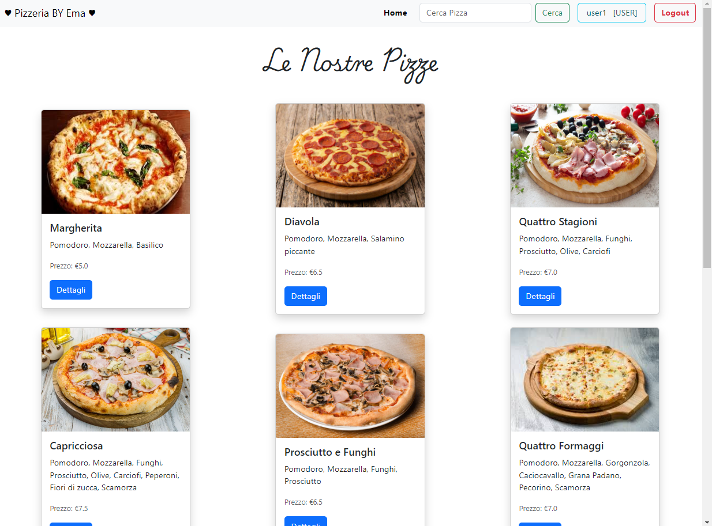
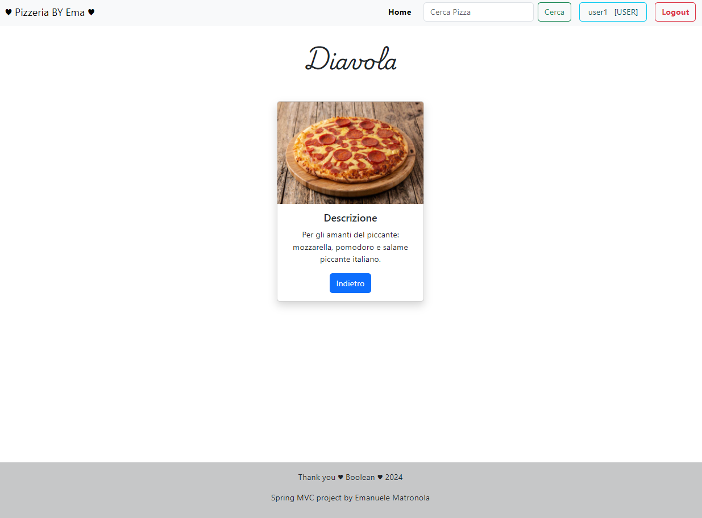
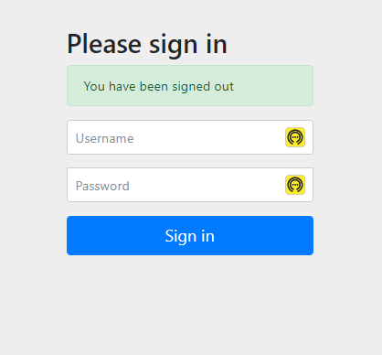
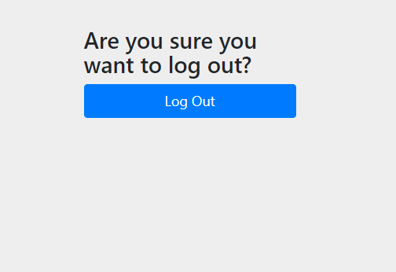

# la-mia-pizzzeria-Security_MySQL DataBase

## Index user1 - senza privilegi ADMIN

## Dettagli Pizze user1 - senza privilegi ADMIN

## Index admin1 - con privilegi ADMIN (compare la voce "Dashboard" sulla Navbar)

## Login

## Logout

## Gestione Pizze

## Gestione Offerte

## Gestione Ingredienti

## Nuova Pizza

## Nuova Offerta

## Nuovo Ingrediente

## Modifica Pizza

## Modifica offerta

## Esercizio di oggi: Spring La Mia Pizzeria Security
___________________________________________________________________________________________________

### proteggiamo la nostra applicazione!

Abbiamo sviluppato tutte le pagine per gestire la nostra pizzeria (elenco pizze, dettagli singola pizza, creazione, modifica, cancellazione, offerte speciali, ingredienti)…
ma vogliamo che chiunque possa effettuare queste operazioni?

Sicuramente no!

Quindi inseriamo l’autenticazione in modo che solo gli utenti registrati possano accedere a queste pagine.
Creiamo le entity necessarie e popoliamo a mano i dati degli utenti nel database.

### Sono previsti due ruoli : USER e ADMIN

Gli utenti con ruolo USER possono accedere solo alla pagina index e a quella di dettaglio.
Gli utenti ADMIN possono fare tutto.